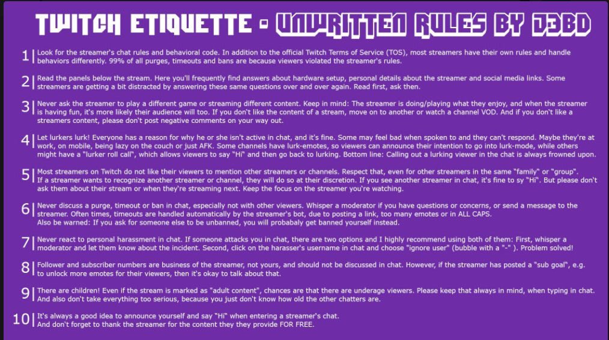

1. Twitch Community Guidelines
- Mit benutzen des Chats stimmst du automatisch den Community Guidelines von Twitch zu.  
Diese kannst du [hier](https://www.twitch.tv/p/de-de/legal/community-guidelines/) einsehen!

2. Sei kein Idiot!
- Wirklich, ohne Witz. Sei einfach kein Idiot!

3. Keine ungefragte/n Werbung oder Links!
- Keine Links zu komischen Seiten, anderen Streams oder ähnliches OHNE erlaubnis.

4. Seid nett und respektvoll!
- Ihr könnt gerne im Chat zum aktuellen Stream- bzw. RP-Geschehen diskutieren aber bitte nett und respektvoll!  
Respektiert meine und die Privatsphäre der anderen.

5. Spam, Spoiler, Meta- und Backseatgaming
- Kein Spam, Spoiler, Meta- oder Backseatgaming, außer ich bitte explizit um Hilfe!

6. Rassismus und Sexismus
- Der Chat ist von beidem Sauber zuhalten.

7. Alter
- Redet nicht über das Alter, der Stream ist ab 18!

8. Straffreiheit
- Ausreden wie "Ich hab die Regeln nicht gelesen" oder "Ich hab doch ein Kappa genutzt" schützen nicht vor Strafe.

9. Mods haben immer Recht
- Solltet ihr trotzdem ein Problem mit einer Mod-Entscheidung haben kann dies gerne im #Support-Channel auf meinem [Discord](https://discord.gg/Vv2ZMqW) geklärt werden!

10. Haltet euch bitte an diese Etiquette!
 

Alle weiteren Informationen rund um die Nutzungsbedingungen findest du [hier](https://help.twitch.tv/s/article/twitch-policies-and-guidelines)